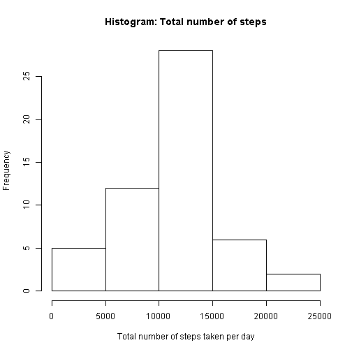
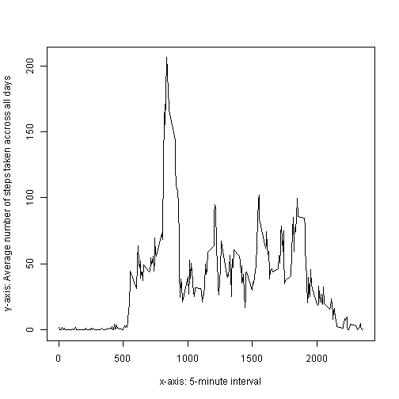

---
copyright:
title: 'Reproducible Research: Assignment No 1'
author: "Mariya Atanasova"
date: "Saturday, February 07, 2015"
output: html_document
keep_md: true
---
###Loading the necessary libraries and setting the constants

```r
library(dplyr)
setwd("C:/coursera/ReproducibleResearch")
fileName <- "activity.csv"
```

### Loading and Preprocessing the data 
Will read the data from the data file that we have downloaded locally and unzipped and then load this data into **actData**   
Making sure all columns are strings 


```r
actData <- read.csv(fileName, header=TRUE, stringsAsFactors=FALSE)
actData <- tbl_df(actData)
summary(actData)
```

     steps            date              interval     
 Min.   :  0.00   Length:17568       Min.   :   0.0  
 1st Qu.:  0.00   Class :character   1st Qu.: 588.8  
 Median :  0.00   Mode  :character   Median :1177.5  
 Mean   : 37.38                      Mean   :1177.5  
 3rd Qu.: 12.00                      3rd Qu.:1766.2  
 Max.   :806.00                      Max.   :2355.0  
 NA's   :2304                                        

### Calculating the mean for the total number of steps taken per day 
Ignoring missing values

1. Calculate the total number of steps taken per day
2. Make a histogram of the total number of steps taken each day
3. Calculate and report the mean and median of the total number of steps taken per day


```r
cleanActData <- filter(actData, !is.na(actData$steps))
cleanActData <- mutate(cleanActData, date=as.Date(date))
byDay <- group_by(cleanActData, date)
stepsDaily <- summarize(byDay, sum_steps=sum(steps), mean_steps=mean(steps))

print(stepsDaily) #table containing total number of steps per day
```

```
## Source: local data frame [53 x 3]
## 
##          date sum_steps mean_steps
## 1  2012-10-02       126    0.43750
## 2  2012-10-03     11352   39.41667
## 3  2012-10-04     12116   42.06944
## 4  2012-10-05     13294   46.15972
## 5  2012-10-06     15420   53.54167
## 6  2012-10-07     11015   38.24653
## 7  2012-10-09     12811   44.48264
## 8  2012-10-10      9900   34.37500
## 9  2012-10-11     10304   35.77778
## 10 2012-10-12     17382   60.35417
## ..        ...       ...        ...
```

```r
hist(stepsDaily$sum_steps, xlab="Total number of steps taken per day", main="Histogram: Total number of steps")
```

 

```r
#####need to sort bofore taking median value!!!!!!!!!!
stepsDaily <- arrange(stepsDaily, sum_steps)
mean(stepsDaily$sum_steps)
```

```
## [1] 10766.19
```

```r
median(stepsDaily$sum_steps)
```

```
## [1] 10765
```

###Average Daily Activity Pattern 

The code below will make a time series plot (i.e. type = "l") of the 5-minute interval (x-axis) and the average number of steps taken, averaged across all days (y-axis)


```r
byInterval <- group_by(cleanActData, interval)
stepsByInterval <- summarize(byInterval, avg_steps_by_interval=mean(steps))
plot(stepsByInterval, type='l', xlab="x-axis: 5-minute interval", ylab="y-axis: Average number of steps taken accross all days")
```

 

```r
maxAveragePeriod <- filter(stepsByInterval, avg_steps_by_interval==max(avg_steps_by_interval))
```

Note: Now with maxAveragePeriod variable we can easily display Which 5-minute interval (answer: at exactly 835 minutes), on average across all the days in the dataset, contains the maximum number of steps averaged accross all days (hint: max number of steps =  206.1698113)


### Imputing Missing Values

---
copyright:
title: 'Reproducible Research: Assignment No 1'
author: "Mariya Atanasova"
date: "Saturday, February 07, 2015"
output: html_document
---
###Loading the necessary libraries and setting the constants

```r
library(dplyr)
setwd("C:/coursera/ReproducibleResearch")
fileName <- "activity.csv"
```

### Loading and Preprocessing the data 
Will read the data from the data file that we have downloaded locally and unzipped and then load this data into **actData**   
Making sure all columns are strings 


```r
actData <- read.csv(fileName, header=TRUE, stringsAsFactors=FALSE)
actData <- tbl_df(actData)
summary(actData)
```

     steps            date              interval     
 Min.   :  0.00   Length:17568       Min.   :   0.0  
 1st Qu.:  0.00   Class :character   1st Qu.: 588.8  
 Median :  0.00   Mode  :character   Median :1177.5  
 Mean   : 37.38                      Mean   :1177.5  
 3rd Qu.: 12.00                      3rd Qu.:1766.2  
 Max.   :806.00                      Max.   :2355.0  
 NA's   :2304                                        

### Calculating the mean for the total number of steps taken per day 
Ignoring missing values

1. Calculate the total number of steps taken per day
2. Make a histogram of the total number of steps taken each day
3. Calculate and report the mean and median of the total number of steps taken per day


```r
cleanActData <- filter(actData, !is.na(actData$steps))
cleanActData <- mutate(cleanActData, date=as.Date(date))
byDay <- group_by(cleanActData, date)
stepsDaily <- summarize(byDay, sum_steps=sum(steps), mean_steps=mean(steps))

print(stepsDaily) #table containing total number of steps per day
```

```
## Source: local data frame [53 x 3]
## 
##          date sum_steps mean_steps
## 1  2012-10-02       126    0.43750
## 2  2012-10-03     11352   39.41667
## 3  2012-10-04     12116   42.06944
## 4  2012-10-05     13294   46.15972
## 5  2012-10-06     15420   53.54167
## 6  2012-10-07     11015   38.24653
## 7  2012-10-09     12811   44.48264
## 8  2012-10-10      9900   34.37500
## 9  2012-10-11     10304   35.77778
## 10 2012-10-12     17382   60.35417
## ..        ...       ...        ...
```

```r
hist(stepsDaily$sum_steps, xlab="Total number of steps taken per day", main="Histogram: Total number of steps")
```

 

```r
#####need to sort bofore taking median value!!!!!!!!!!
stepsDaily <- arrange(stepsDaily, sum_steps)
mean(stepsDaily$sum_steps)
```

```
## [1] 10766.19
```

```r
median(stepsDaily$sum_steps)
```

```
## [1] 10765
```

###Average Daily Activity Pattern 

The code below will make a time series plot (i.e. type = "l") of the 5-minute interval (x-axis) and the average number of steps taken, averaged across all days (y-axis)


```r
byInterval <- group_by(cleanActData, interval)
stepsByInterval <- summarize(byInterval, avg_steps_by_interval=mean(steps))
plot(stepsByInterval, type='l', xlab="x-axis: 5-minute interval", ylab="y-axis: Average number of steps taken accross all days")
```

 

```r
maxAveragePeriod <- filter(stepsByInterval, avg_steps_by_interval==max(avg_steps_by_interval))
```

Note: Now with maxAveragePeriod variable we can easily display Which 5-minute interval (answer: at exactly 835 minutes), on average across all the days in the dataset, contains the maximum number of steps averaged accross all days (hint: max number of steps =  206.1698113)
